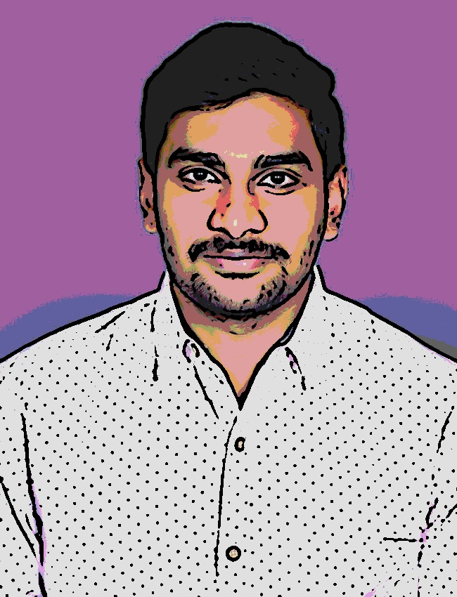

# Machine-Learning-Powered-Image-Cartoonification

## Overview
This project demonstrates how to transform an image into a "cartoon" version by applying various image processing techniques such as Gaussian Blur, Median Blur, Bilateral Filter, and edge detection with Laplacian filters. The project also reduces the color space using K-Means clustering to create the cartoon effect.

## Tech Stack Used
- **Languages**: Python
- **Libraries**: 
  - `OpenCV`: For image processing and applying various filters.
  - `NumPy`: For matrix operations and handling image data.
  - `Matplotlib`: For visualizing and plotting the images.
  - `Tkinter`: For the user interface to load images.

## Concepts Involved
- **Image Smoothing**: Techniques such as Gaussian blur, Median blur, and Bilateral filtering are used to smooth the image and reduce noise.
- **Edge Detection**: Laplacian filter is applied to detect edges in the images, which is essential for creating a cartoon-like effect.
- **K-Means Clustering**: The image colors are reduced using K-Means clustering, which helps in creating a more cartoonish and simpler color representation.
- **Image Thresholding**: Otsu's thresholding is used to binarize the image and invert the black-and-white values to further highlight edges.
- **Combining Effects**: The final cartoon image is created by combining the edge-detected image with the color-reduced version.

## Dataset/Images Used
This project works with any input image provided by the user. In the code, the image is loaded from my google drive `/content/drive/MyDrive/810_4776.jpg`.

## Installation

1. **Clone the repository**:
   ```bash
   git clone https://github.com/yourusername/cartoonify-project.git

2. **Install the required libraries**:
   If you are running the notebook locally, you can install the required dependencies with the following commands:
   ```bash
   pip install opencv-python-headless numpy matplotlib tkinter
3. **Running on Google Colab**: 
   If you prefer running the project on Google Colab, the environment will have most of the libraries pre-installed. You may need to upload your image files and modify paths accordingly.

## How to Run the Code

### Running the Notebook
1. **Open the Notebook**: Open the Jupyter Notebook (`Project.ipynb` or `Rosy team.ipynb`) in your local Jupyter environment or Google Colab.
2. **Upload Your Image**: Provide the image path to `cv2.imread()` to upload your image to be processed.
3. **Run the Cells**: Execute the notebook cells sequentially to apply image smoothing, edge detection, color reduction, and finally cartoonification.
4. **Output**: The output will be displayed in the notebook, and the cartoon image will be saved locally or to your Google Drive, depending on your configuration.

### User Interface (Optional)
The project also includes code for using `Tkinter` to browse and load images from your local filesystem, simplifying the process of selecting images.

## Example Outputs

### Original Image


### Cartoonified Image


## Process Workflow

### Image Smoothing
- **Gaussian Blur**: Applied to reduce noise.
- **Median Blur**: Used for additional smoothing.
- **Bilateral Filter**: Further smooths while preserving edges.

### Edge Detection
- **Laplacian Filter**: Applied to detect edges on both the original and smoothed images.

### Thresholding & Color Inversion
- **Thresholding (Otsu’s Method)**: Converts the image to black and white (binarized).
- **Inversion**: Performed to ensure edges are prominent.

### Color Reduction
- **K-Means Clustering**: Used to reduce the color palette of the image.
- The image is divided into color bins for a simpler, cartoon-like effect.

### Final Cartoon Image
- The edge-detected image is combined with the color-reduced image to create the final cartoon effect.

## License
This project is licensed under the MIT License.

## Contact
If you have any questions or issues, feel free to reach out:
- **Email**: kankipad@oregonstate.edu
- **LinkedIn**: [Madhav Kumar Kankipati](https://www.linkedin.com/in/madhav-kumar-kankipati-49293a182/)
